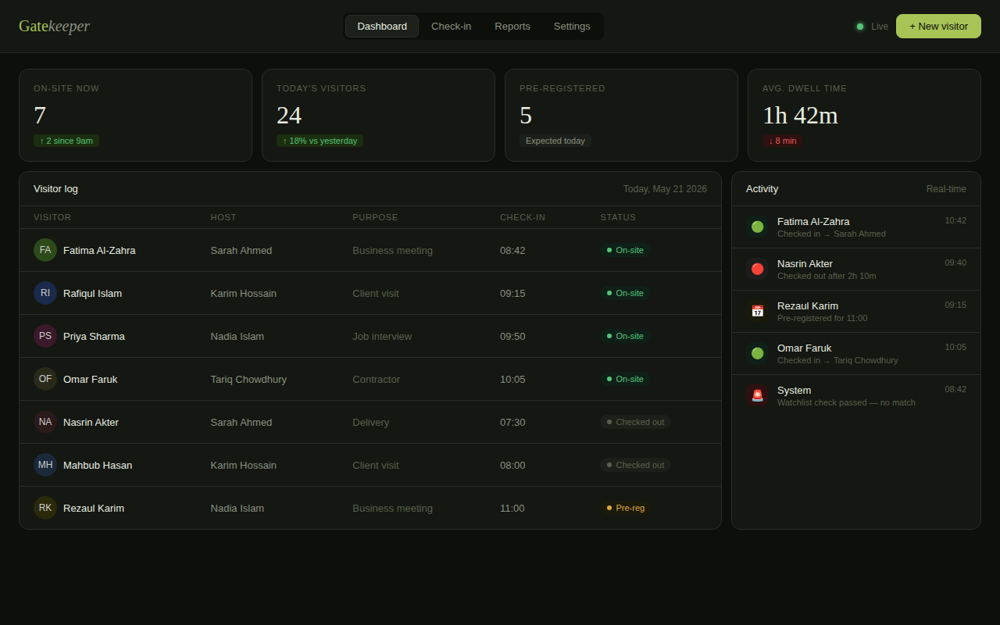
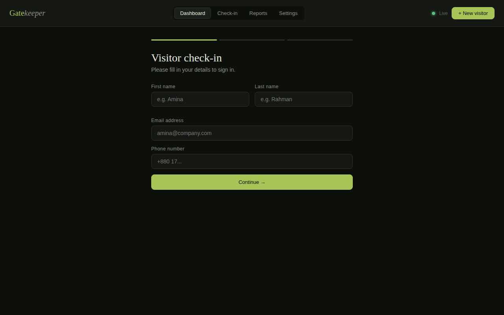
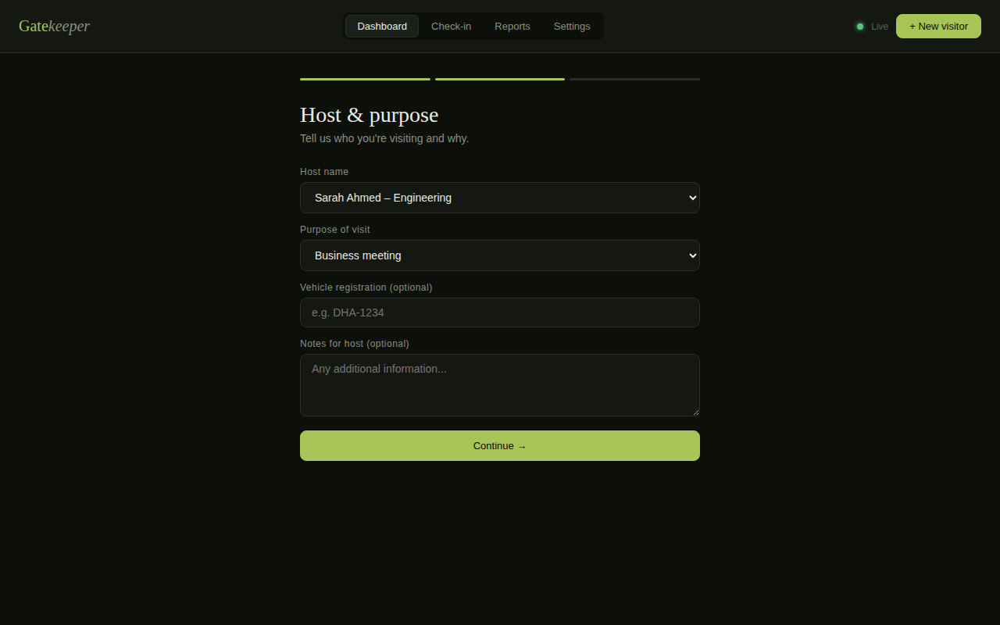
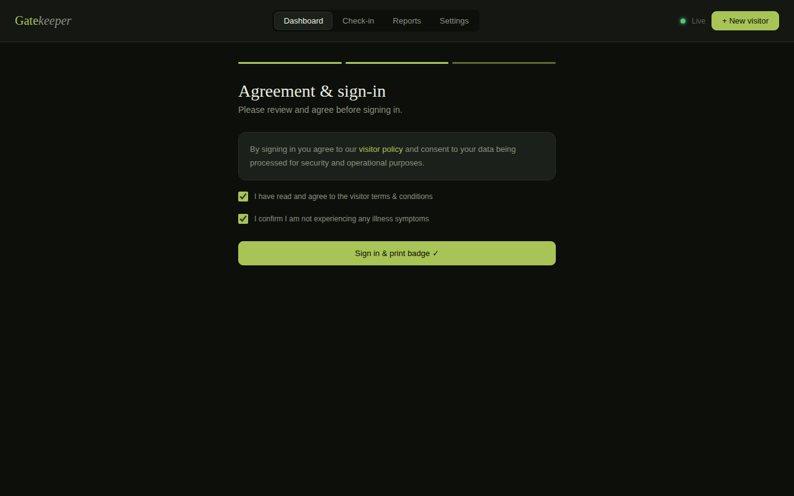
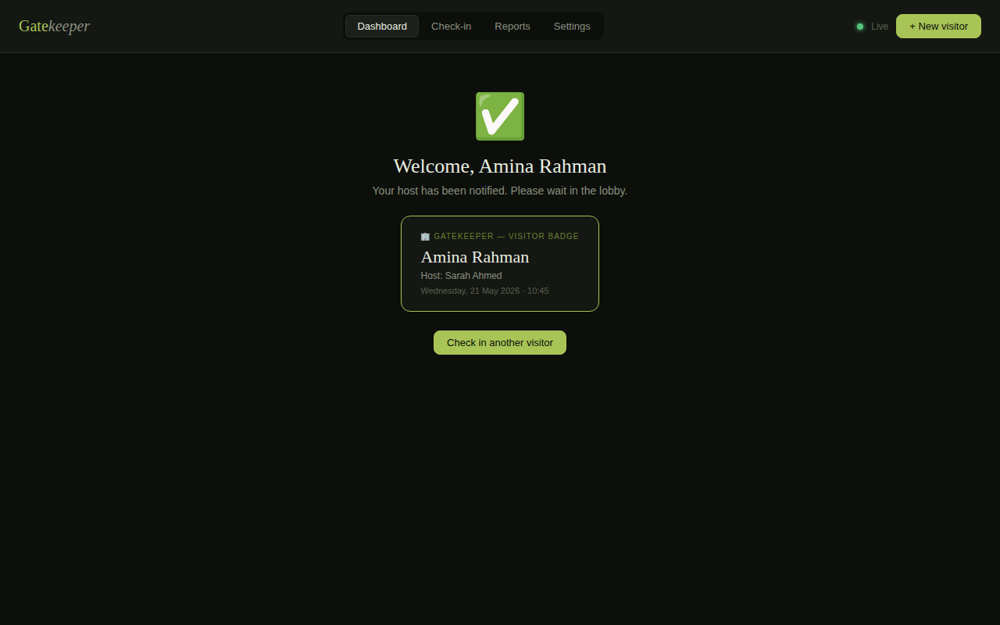
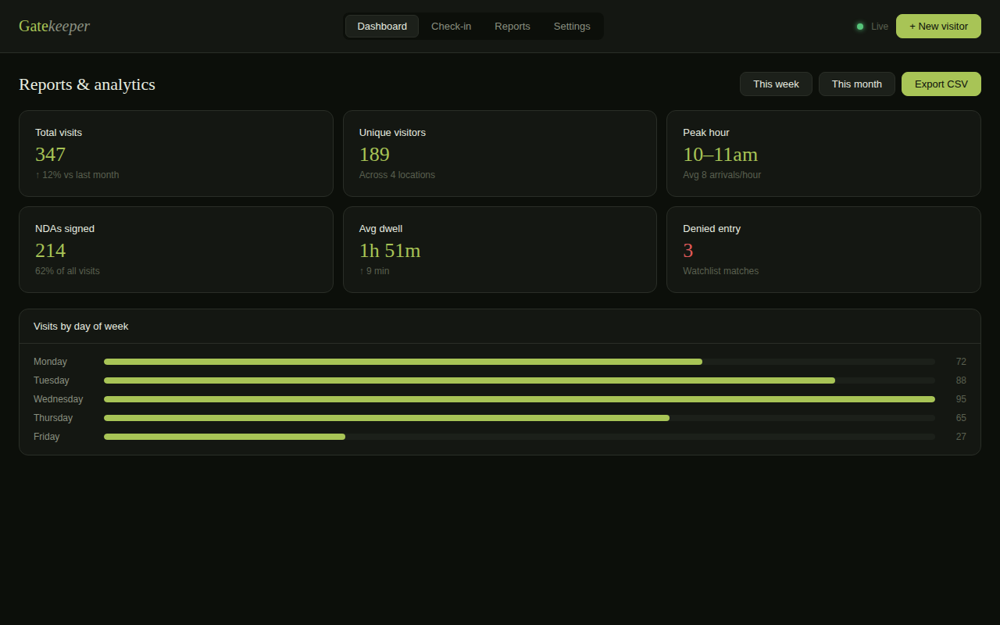
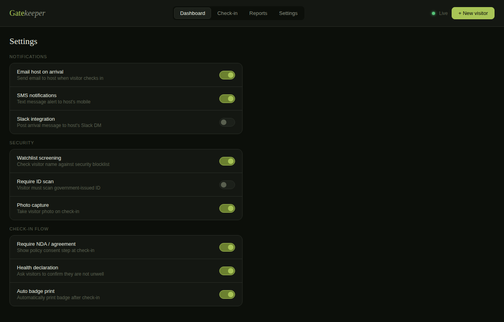

# Gatekeeper — Visitor Management System

> A modern, dark-themed web app for managing visitors, check-ins, badges, and security at your facility.

---

## Table of Contents

1. [Overview](#overview)
2. [Dashboard](#dashboard)
3. [Visitor Check-in Flow](#visitor-check-in-flow)
4. [Reports & Analytics](#reports--analytics)
5. [Settings](#settings)
6. [Feature Summary](#feature-summary)

---

## Overview

**Gatekeeper** is a fully interactive Visitor Management System (VMS) built as a single-page web application. It provides receptionists and security teams with everything they need to track, manage, and report on visitors in real time.

- **Tech stack:** HTML · CSS · Vanilla JavaScript
- **Theme:** Dark professional (`#0C0F0A` background, `#A8C456` accent)
- **Fonts:** DM Serif Display (headings) · DM Sans (body)

---

## Dashboard

The dashboard is the home screen. It shows a live overview of all visitor activity including key metrics, the full visitor log, and a real-time activity feed.

### Key Metrics

| Metric | Description |
|---|---|
| **On-site now** | Visitors currently inside the building |
| **Today's visitors** | Total check-ins since midnight |
| **Pre-registered** | Upcoming visitors expected today |
| **Avg. dwell time** | Average time visitors spend on-site |

### Visitor Log

Displays every visit with: Visitor name · Host · Purpose · Check-in time · Status badge (On-site / Checked out / Pre-reg)

### Activity Feed

Real-time log: 🟢 check-ins · 🔴 check-outs · 📅 pre-registrations · 🚨 security scan results

---

## Visitor Check-in Flow

A guided **3-step form** walks visitors through the sign-in process.

### Step 1 — Personal Details

Collects: First name · Last name · Email address · Phone number

---

### Step 2 — Host & Purpose

Collects: Host name (dropdown) · Purpose of visit · Vehicle registration (optional) · Notes for host (optional)

---

### Step 3 — Agreement & Sign-in

Visitor must confirm:
- ✅ Agreement to visitor terms & conditions (NDA / policy)
- ✅ Health declaration (not experiencing illness symptoms)

---

### Badge Preview — Success Screen

After check-in, the host is instantly notified and a visitor badge is generated showing: name · host · date & time.

---

## Reports & Analytics

Visit statistics for the current week or month, with CSV export.

### Summary Cards

| Card | Description |
|---|---|
| Total visits | Count + % change vs last period |
| Unique visitors | Distinct individuals across all locations |
| Peak hour | Busiest arrival window |
| NDAs signed | Agreements completed at check-in |
| Avg. dwell time | Mean time on-site |
| Denied entry | Watchlist match count (shown in red) |

---

## Settings

Toggle all system features on/off, grouped into three sections.

| Section | Settings |
|---|---|
| **Notifications** | Email host · SMS · Slack integration |
| **Security** | Watchlist screening · ID scan · Photo capture |
| **Check-in flow** | NDA required · Health declaration · Auto badge print |

---

## Feature Summary

| # | Feature | Description |
|---|---|---|
| 1 | Live dashboard | Real-time visitor log and activity feed |
| 2 | Pre-registration | Hosts can invite guests in advance |
| 3 | 3-step check-in | Guided form with validation at each step |
| 4 | Host notifications | Instant alert on visitor arrival |
| 5 | NDA & agreements | Digital consent collected at check-in |
| 6 | Health declaration | Wellness confirmation before entry |
| 7 | Badge generation | Auto-printed badge with name, host & time |
| 8 | Check-out tracking | Record departure and calculate dwell time |
| 9 | Watchlist screening | Security check on every visitor entry |
| 10 | Analytics & reports | Visit trends, peak hours, dwell time |
| 11 | CSV export | Download reports for external analysis |
| 12 | Settings panel | Toggle all system features on/off |

---

## Integrations (extensible)

- 📧 Email (SMTP / SendGrid)
- 💬 Slack webhook
- 📅 Google Calendar / Outlook
- 🔐 Active Directory / SSO
- 🖨️ Badge printer (Zebra / Brother)
- 📷 Webcam / ID scanner
- 🚪 Door access control (HID, Brivo)
- 🔗 REST API / webhooks for custom workflows

---

*Gatekeeper VMS — Built with HTML, CSS & JavaScript · © 2026*
